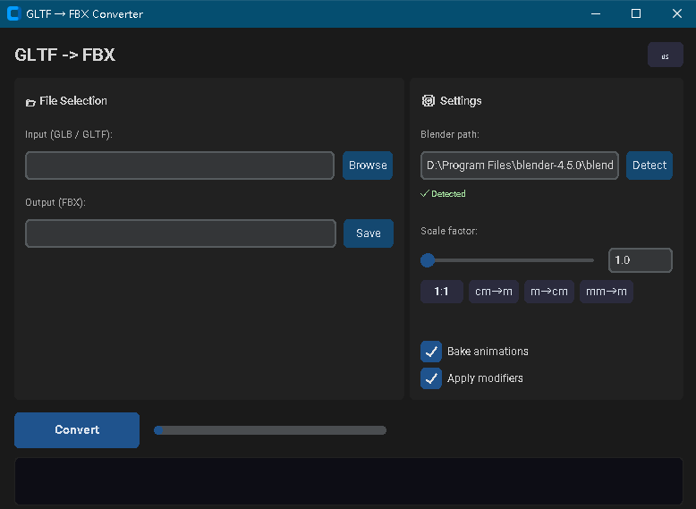

# GLTF → FBX 转换器

使用 **Blender** 作为后端引擎,将 GLTF/GLB 3D 模型转换为 FBX 格式。



## 功能

- ✅ **GLB** (Binary) 和 **GLTF** (JSON) 输入
- ✅ **PBR 材质** (Base Color, Metallic, Roughness, Normal, Emissive, AO)
- ✅ **骨骼动画** (Skeletal Animation)
- ✅ **形变目标** (Morph Targets / Shape Keys / Blend Shapes)
- ✅ **纹理** (自动复制或嵌入)
- ✅ **缩放控制** (用于解决不同软件间的单位差异)
- ✅ **动画烘焙** (确保动画在所有 DCC 中一致)
- ✅ 自动查找系统 Blender 安装

## 依赖

- **Blender 3.6+** — [下载 Blender](https://www.blender.org/download/)
- Python 3.10+ (可选,仅 wrapper 脚本需要)

## 快速开始

### 🖥️ 图形界面 (推荐)

```batch
:: 双击 run_gui.bat 启动
run_gui.bat
```

支持:
- 📂 **拖拽或浏览**选择 GLB/GLTF 文件
- 🎚️ **滑块 / 预设按钮**控制缩放因子 (1:1, cm→m, m→cm, mm→m)
- 📋 **实时日志**显示转换进度
- 🔍 **自动检测** Blender 安装路径
- ✅ 动画烘焙、修改器应用开关

界面基于 tkinter (Python 内置),主题为 Catppuccin Mocha 暗色风格。

### Windows (CMD)

```powershell
.\convert.ps1 -InputPath model.glb
.\convert.ps1 -InputPath scene.gltf -OutputPath scene.fbx
.\convert.ps1 -InputPath model.glb -Blender "D:\Blender\blender.exe" -Scale 100
```

### 跨平台 (Python wrapper)

```bash
python gltf2fbx.py -i model.glb -o model.fbx
python gltf2fbx.py -i scene.gltf -o scene.fbx --scale 100
python gltf2fbx.py -i model.glb -o model.fbx --blender /path/to/blender
```

### 直接使用 Blender

```bash
blender --background --python gltf2fbx.py -- --input model.glb --output model.fbx
```

## 参数说明

| 参数 | 简写 | 说明 | 默认值 |
|------|------|------|--------|
| `--input` | `-i` | 输入 GLTF/GLB 文件路径 (必需) | - |
| `--output` | `-o` | 输出 FBX 文件路径 (必需) | - |
| `--blender` | `-b` | Blender 可执行文件路径 | 自动检测 |
| `--scale` | `-s` | 缩放因子 (如 100 = 厘米→米) | `1.0` |
| `--no-bake` | - | 不烘焙动画 | `False` |
| `--no-modifiers` | - | 不应用修改器 | `False` |
| `--dry-run` | - | 仅打印命令,不执行 | `False` |

## 常见场景

### Unity GLTF → Unreal FBX

```bash
# Unity 默认 1 unit = 1m, Unreal 默认 1 unit = 1cm
python gltf2fbx.py -i unity_export.glb -o unreal_import.fbx --scale 100
```

### Blender GLTF → Maya FBX

```bash
python gltf2fbx.py -i model.gltf -o model.fbx
# FBX 使用 Y-up, -Z-forward; 已自动配置
```

### 批量转换

```powershell
# PowerShell
Get-ChildItem *.glb | ForEach-Object {
    .\convert.ps1 -InputPath $_.FullName
}
```

## 许可证

MIT
